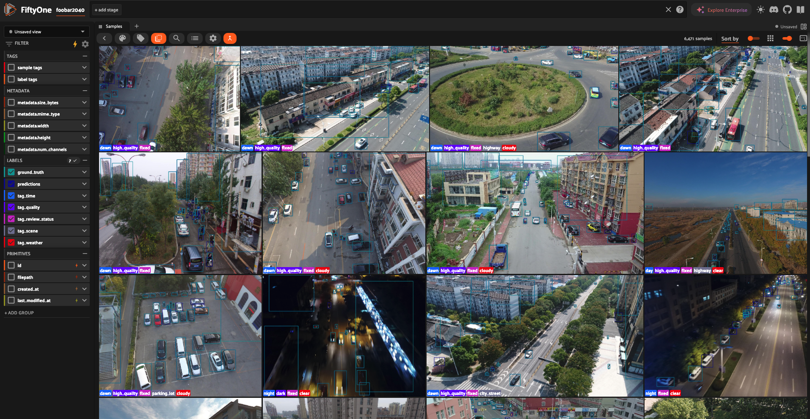
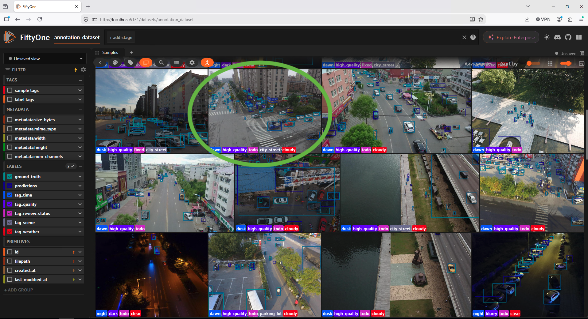
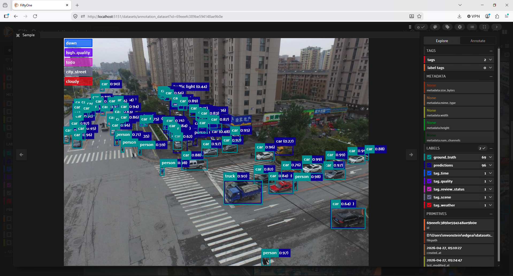
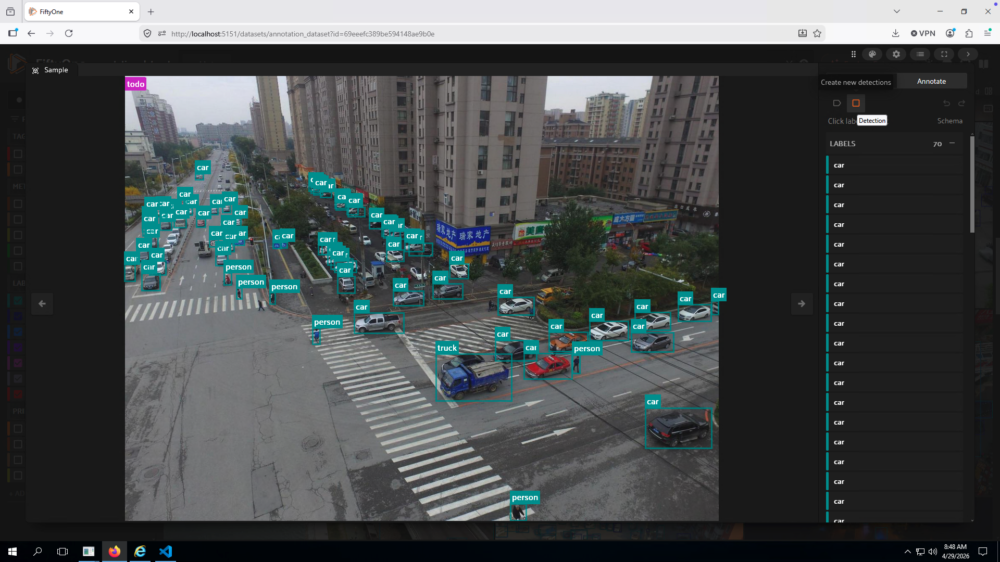
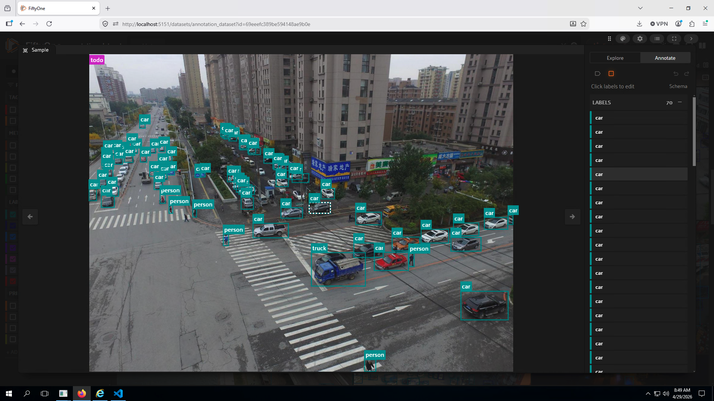
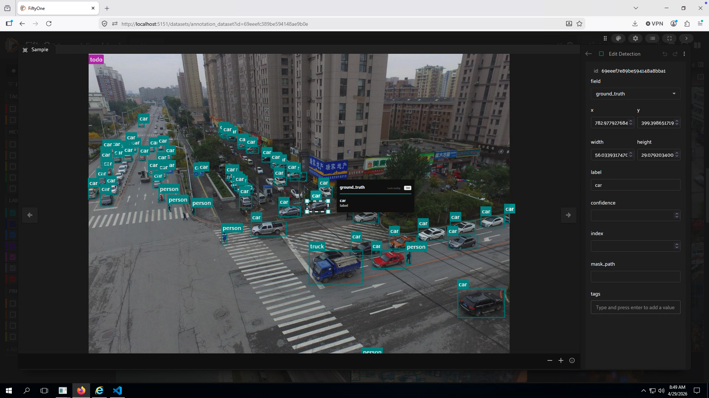
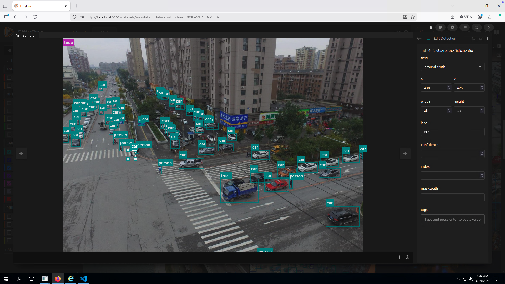
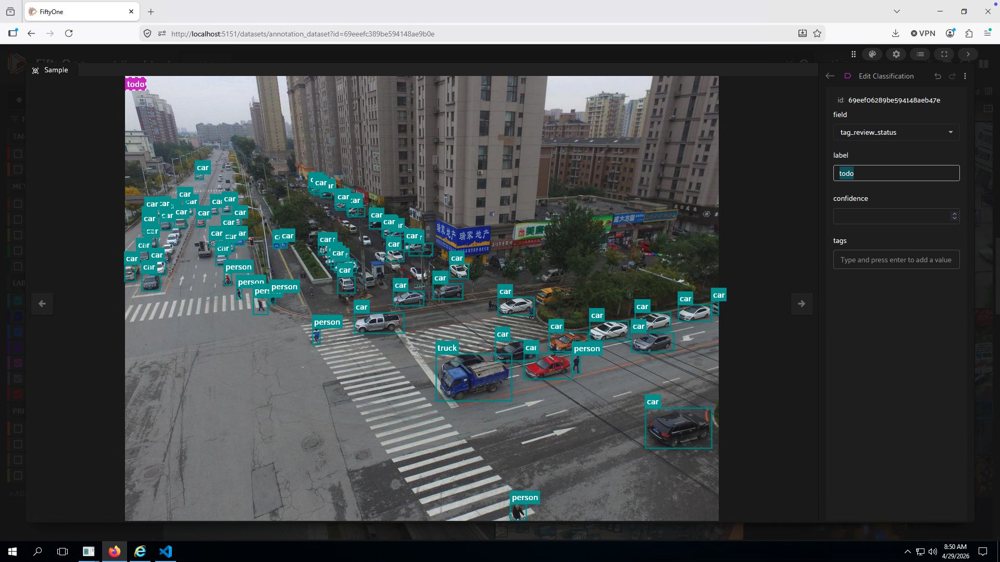

# EdgeAI

## Thesis

Changing deployment circumstances and austere environments beget the need for edge AI. 

## Instructions for Human Labellers

Assume you have a machine where the fiftyone interface is already set up. Open `http://localhost:5151` in a browser. Firefox often works well. It should say `http://localhost:5151/datasets/annotation_dataset` in the search bar and the interface should look like this:


Pick a sample that is still labelled "todo" as opposed to "fixed". "Fixed" means a human annotator has already reviewed it.


Double click to open it in the UI. It will open in "Explore" mode:


Open "Annotation" mode by hitting the tab next to "Explore" and click on the checkbox that enables detection edits:


You will now be able to edit the ground truth bounding boxes and their labels. You can change the shape of the bounding box, change the confidence (range 0.0 to 1.0), rename the class label, or delete the detection. Select the detection you want to label either through the bounding box in the image or by double-clicking the correct detection in the list of annotations on the right. Changes will save automatically as you go.


To edit the shape of the bounding box, click and drag on any of the corners of the bounding box in the image. Or, you can manually edit the placement of the top left corner and width and height of the bounding box in the right side panel:


If you want to delete the detection, use this button in the upper right corner of the open sample dialog box that says "Delete label":


You can also choose to make a new detection for something the ground truth missed. For example, this person was not part of the original detections. Draw a bounding box and change the label so it reflects the correct class. FiftyOne automatically uses the same class label as the last detection you interacted with. Here we will need to change the label from "car" to "person" and give it confidence=1.0.



When you're done with this sample, find the "todo" label in the right panel and change it to "fixed" and exit out of the sample dialog by clicking outside it.



When you exit out of the sample dialog you will see that your sample is marked "fixed":
~[](figures/sample_now_marked_fixed.png)

## Instructions to setup and use the FiftyOne Labelling interface on your own machine
This pipeline relies on Python 3.12.8. Follow the [link](https://www.python.org/downloads/release/python-3128/) for installation instructions. After installation, check what python version you have active in your terminal by running `python --version`. Your output should match `Python 3.12.8`.

Next setup your environment:
```bash
./install_mac.sh # if your machine is a mac
./install.bat # if your machine is windows
./install.sh # if your machine is linux
```

Then unzip `VisDrone2019-DET-train.zip` to wherever you want your data to live. I put it in `datasets/` directory created during the install script.


Run the labelling UI:
```bash
cd fiftyone_labelling/
# setup your fiftyone dataset. this will persist between runs of the following scripts if you use the same --dataset-name because it's saved locally in a mongodb if you set persistent=True
python import_dataset.py --images /Users/mvonstein/edgeai/datasets/VisDrone2019-DET-train/images/ --json ../datasets/VisDrone2019-DET-train/complete_dataset.json --dataset-name annotation_dataset
# new dataset, import all tags and export everything
python fiftyone_human_annotation.py /Users/mvonstein/edgeai/datasets/VisDrone2019-DET-train/images/ --dataset-name annotation_dataset  --import-tags tags.json --export annotation_dataset --export-tags annotation_dataset.json --format coco
# Export your dataset to a zip from your mongodb if you want to port it between systems or who knows what else:
python fix_export.py annotation_dataset 
```

when FiftyOne opens in your browser it should say `http://localhost:5151/datasets/annotation_dataset` in the search bar and the interface should look like this:


> [!WARNING]
> If you use a different name for --dataset-name, you're creating a new mongodb reference. So, changes to annotation_dataset won't persist to new_dataset_a9e013f (for example)


The first 11-ish images are examples for how a properly labelled images will look (I labelled them "fixed" and the new labels have confidence=1.00). Use those as references. Spend some time playing with the interface so you understand how it works. Then, time how long it takes you to label 10 images by filling out the following chart:

## Other (non-fiftyone) interfaces

Generate new data for human labelling using interfaces other than FiftyOne:
```bash
# Run video frame extraction for video datasets
python3 video_frame_extractor_fixed.py path/to/videos
# Run human annotation with web interface on provided test data (open in firefox)
python3 gradio_annotation_ui_synced_rectangles.py ./test_data/Explosion004_x264_24_20260327_104203_5324ec27/
```

There are also OpenCV versions and a scraper that is autolabelled using search terms assuming good SEO.

## All Candidate Datasets
Download and unzip to `datasets/` directory, which is created by the `install.sh` script.

- VIRAT shaky drone footage: [VIRAT dataset](https://viratdata.org/#getting-data)

- CCTV: [kaggle download](https://www.kaggle.com/datasets/jonathannield/cctv-action-recognition-dataset)

- DCSASS: [kaggle download](https://www.kaggle.com/datasets/mateohervas/dcsass-dataset)

- xView natural disaster images: make an account at [xView2](https://xview2.org/) to access. I recommend starting with the Challenge training set (~7.8 GB).s

- VisDrone dataset: [github link to datasets](https://github.com/VisDrone/VisDrone-Dataset). If you want to replicate what Meriel did, Download your dataset to the `datasets/` folder by following this link for the [VisDrone trainset (7.53 GB) under Task 2: Object Detection in Videos](https://github.com/VisDrone/VisDrone-Dataset). XView2 first place winning dataset [here](https://github.com/DIUx-xView/xView2_first_place).

- Create your own classification dataset by running `python3 create_vehicle_dataset.py`

## Troubleshooting

If the image annoation UI does not load the files, use the fully qualified pathname to the image directory or run:
```bash
python3 fix_image_loading.py ./test_data/Explosion004_x264_24_20260327_104203_5324ec27/
```

## Project status


### Roadmap

### TODOs
| Timeframe    | Deliverable           | Notes                |
|--------------|-----------------------|----------------------|
| End of June  | Project wrap-up       | Present to K. Best   |


### Support 
Meriel von Stein, CS PhD, RAND Info Scientist, mvonstein@rand.org

### Contributing
See also: https://code.rand.org/lazhang/mlopplot
